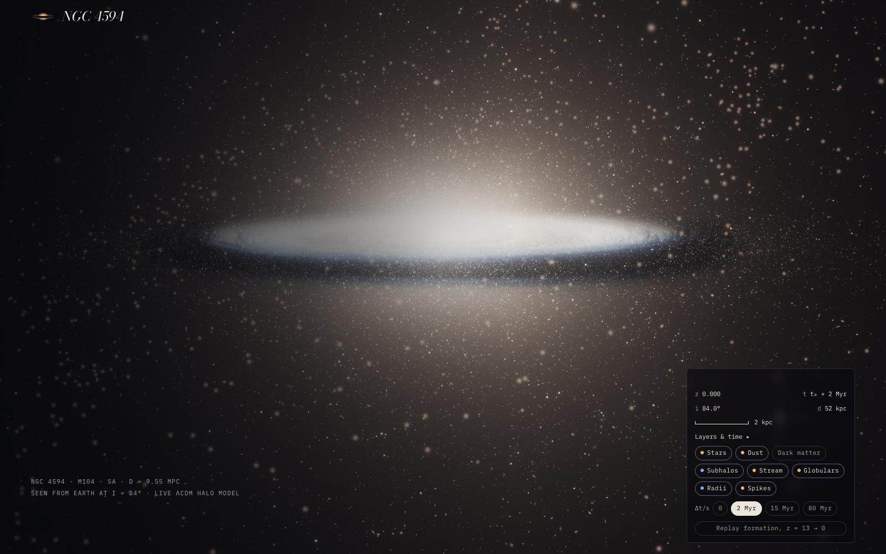
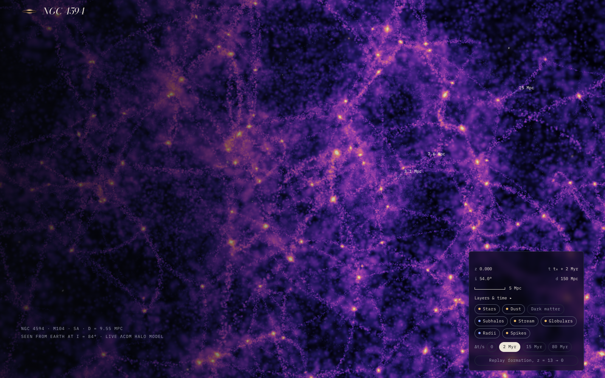
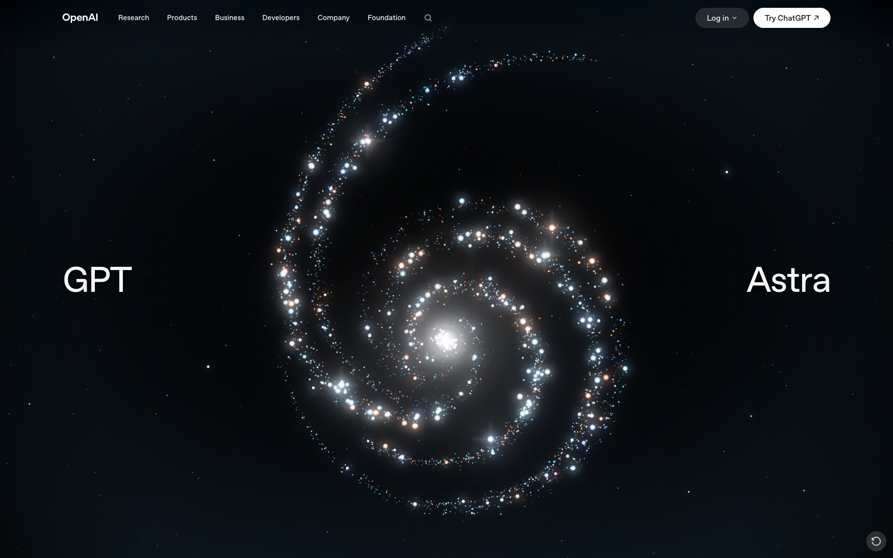
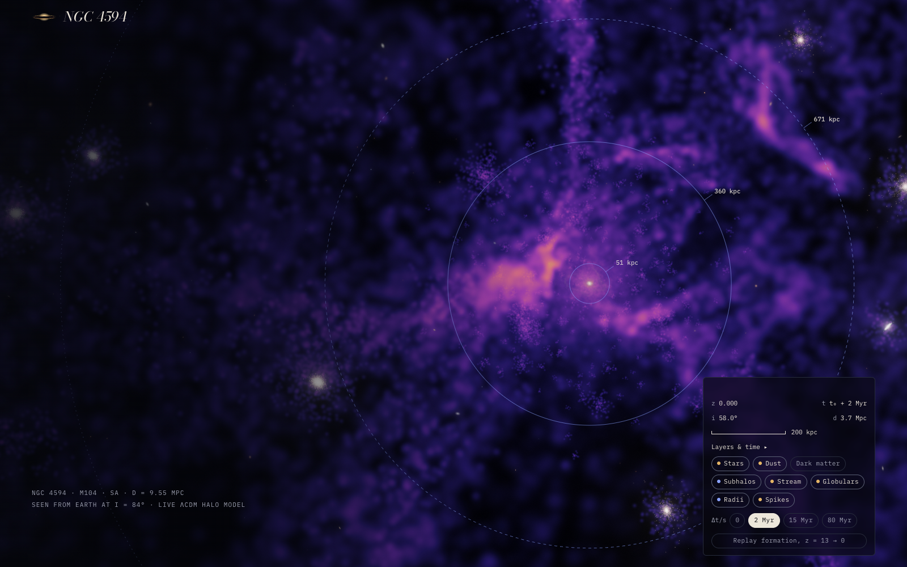

# NGC 4594

A live, in-browser model of the [Sombrero Galaxy](https://en.wikipedia.org/wiki/Sombrero_Galaxy) (M104), its dark matter halo, and the cosmic web it sits in. Scroll to zoom out from the galaxy to 150 Mpc of large-scale structure. Every frame is computed from one gravitational potential.

**[Open the live page →](https://kotval.github.io/ngc4594/)**

This is an artistic interpretation rather than research code. The colours, brightness and dust texture are tuned by eye against the Hubble plate, even down to the cross shaped diffraction spikes due to Hubble's support struts; however, the structure underneath is real physics, with parameters pulled from relevant papers, and the motion you see is the motion the potential requires.

## The physics, briefly

**The galaxy.** The Sombrero is a galaxy of unknown classification. Since I let the viewer pan, I had to make a decision, and I chose to represent it as a [spiral galaxy](https://en.wikipedia.org/wiki/Spiral_galaxy). The real object is 9.55 Mpc away, seen almost edge-on. Its gravity is modelled as three summed components: a Hernquist bulge, a Miyamoto–Nagai disk and a central black hole. Stars move on epicyclic orbits whose frequencies come from that potential, so the inner disk laps the outer disk exactly as the [rotation curve](https://en.wikipedia.org/wiki/Galaxy_rotation_curve) dictates. A two-armed [density wave](https://en.wikipedia.org/wiki/Density_wave_theory) turns rigidly at its pattern speed while stars stream through it.

**The dust lane.** The famous brim is a ring of [cosmic dust](https://en.wikipedia.org/wiki/Cosmic_dust) about 9.4 kpc out. A raymarcher integrates emission and absorption through it, with per-channel [extinction](https://en.wikipedia.org/wiki/Interstellar_extinction) that reddens the starlight behind it, plus scattering that keeps the lane brown instead of black. The texture is sheared by differential rotation, using two staggered flow maps so it never winds up.

**The halo.** Around 85% of the mass is dark. It's an [NFW profile](https://en.wikipedia.org/wiki/Navarro%E2%80%93Frenk%E2%80%93White_profile) [dark matter halo](https://en.wikipedia.org/wiki/Dark_matter_halo) of 5 × 10¹² M☉ with a triaxial shape and a concentration taken from the cosmological concentration–mass relation. It is populated with 300 subhalos drawn from a dN/dm ∝ m⁻¹·⁹ mass function on live leapfrog orbits, a splashback radius, about 1,900 bimodal [globular clusters](https://en.wikipedia.org/wiki/Globular_cluster), a [stellar stream](https://en.wikipedia.org/wiki/Stellar_stream) from a disrupting satellite, and a handful of neighbour galaxies.

**The cosmic web.** At the largest scales, matter is displaced from a Gaussian random field with a [ΛCDM](https://en.wikipedia.org/wiki/Lambda-CDM_model) power spectrum. Particles collapse into sheets, the [Zel'dovich pancakes](https://en.wikipedia.org/wiki/Zeldovich_pancake), and then into [filaments](https://en.wikipedia.org/wiki/Galaxy_filament) that feed the nodes. Two nested lattices reach out to 76 Mpc, and the flow keeps running after z = 0 at an exaggerated rate so you can watch it move. The look is modelled on the [Millennium Run](https://en.wikipedia.org/wiki/Millennium_Run). Hit "Replay formation" to watch the whole thing assemble from z = 13.

**The optics.** It's shown the way [Hubble](https://en.wikipedia.org/wiki/Hubble_Space_Telescope) shows it. An asinh display stretch matches how astronomical colour composites are made, and a four-vane [diffraction spike](https://en.wikipedia.org/wiki/Diffraction_spike) filter is applied to bright foreground stars.

The full parameter table, both charts and the references are in the appendix at the bottom of the page.

## Compared with GPT-6 Astra

When OpenAI launched GPT-6 Astra, the announcement page led with a three.js galaxy. It's a spiral of glowing dots bent into the shape of a 6. Pretty, in the way a screensaver is pretty. It has no dust lane, halo, nor inclination; nothing on screen that suggests any of those dots know how fast to go. For a model launched on the strength of its 3D work, it's a remarkably flat idea of what a galaxy is.

It was underwhelming. So I told Claude to look up some papers and start working on this with me. I think this is much better, and I finally found a practical use for my physics education, yay!

## Files

| File | What it is |
|---|---|
| `index.html` | The model with the physics appendix. This is the GitHub Pages site. |
| `demo_landing_page.html` | The same model dressed as a product landing page. |
| `galaxy.js` | The simulation and renderer, shared by both pages. Uses [three.js](https://threejs.org/) from a CDN. |

No build step. Open `index.html` in a browser, or serve the folder with any static server.

### URL options

Add these after `#` in the URL, joined with `&`.

| Option | Effect |
|---|---|
| `stop=hero\|halo\|subhalo\|web\|lss\|model\|cta` | Jump the camera to a scroll stop. |
| `d=…&el=…` | Override the camera distance in kpc and its elevation in degrees, with `stop`. |
| `intro` | Play the formation sequence from z = 13 on load. |
| `off=dust,stars,…` | Start with layers switched off. |
| `debug` | Log shader diagnostics into the page's `data-log` attribute. |

Drag to rotate, double-click to reset. The HUD controls layers and the time rate.
